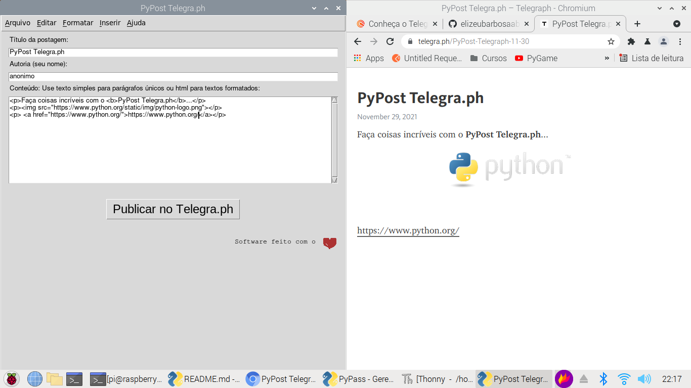
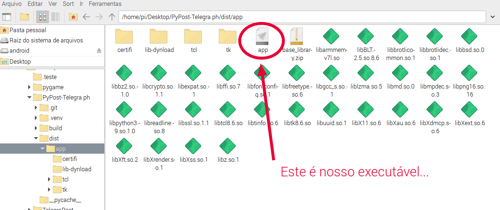

# PyPost Telegra.ph

**PyPost Telegra.ph** é uma versão gráfica para o site http://telegra.ph. Telegra.ph é um sistema de postagens anônimo do Telegram. Basta criar uma postagem e compartilhar o link da postagem gerado no Facebook, Twitter ou qualquer outro lugar...
Telegra.ph tem suporte a links e incorporação do Youtube, Vimeo, twitter e outros...

## Usar o PyPost Telegra.ph é bem fácil:

Preencha com um título, crie um nome de usuário (pode ser fictício), crie o conteúdo e clique no botão [Publicar no Telegra.ph], cole o link que é gerado na área da transferência, tente [CTRL]+[V]...

## Como ter o PyPost Telegra.ph

Primeiramente certifique-se de que tem o Python instalado em seu computador. Baixe o Python [neste link](https://www.python.org/downloads/), se ainda não o possui.

Agora vamos fazer algumas operações avançadas, mas não se preocupe basta seguir o passo a passo: 

**Clone o Repositório com o comando abaixo:**
 
~~~python

git clone https://github.com/elizeubarbosaabreu/PyPost-Telegra.ph

~~~

Agora, ** se estiver usando Linux ou MAC**, abra o terminal e use os comandos abaixo para criar uma venv, instalar as dependências e executar o app.py:
 
~~~python

cd PyPost-Telegra.ph/
python3 -m venv .venv
source .venv/bin/activate
pip install -r requeriments.txt 
python app.py

~~~

Os comandos para o **Windows** são levemente diferentes. Abra o prompt e cole os comandos:

~~~python

cd PyPost-Telegra.ph/
python -m venv .venv
source .venv\Script\activate.bat
pip install -r requeriments.txt 
python app.py

~~~

## Compile tudo para Software:

Se tudo funcionou devidamente e o **PyPost Telegra.ph** abriu com interface gráfica, podemos seguir para o próximo nível convertendo o *app.py* em executável (para não depender mais de comandos). 
Rode o comando:
 
~~~python

pyinstaller app.py

~~~

Agora mova o diretório *app* que foi gerado dentro do diretório *dist* para onde você quiser e renomeie-o (exemplo *TelegraPost*, opcional). Dentro desta pasta estará um executável com o nome **app** 

Gere um atalho para este executável...

## No **Raspberry** e outras distribuições LInux baseadas no debian, mova para o diretório /opt e renomeie o app com o comando abaixo:
 
~~~python

sudo mv dist/app/ /opt/PyTelegraPost

~~~

Agora use o *Alacarte* ou outro Editor de menu e crie um link para o executável:
 
~~~python

/opt/PyTelegraPost/app

~~~

## Obrigado por utlizar nosso software. Compartilhe o conhecimento!!!